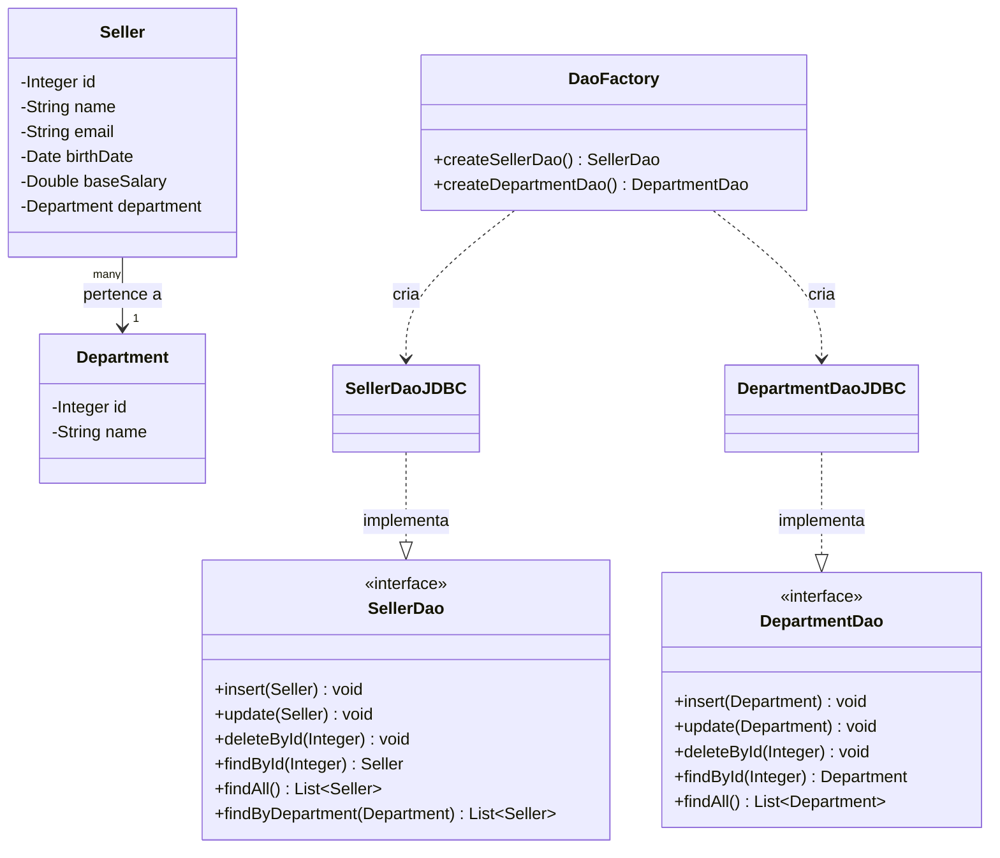

# Padrão DAO com JDBC (Java)

Projeto de estudo que implementa o padrão **DAO (Data Access Object)** com **JDBC puro** sobre um banco de dados MySQL, com foco em desacoplar a lógica de negócio da lógica de persistência. Modela um pequeno domínio `Seller` (vendedor) / `Department` (departamento) com CRUD completo.

> **Nota para recrutadores:** o `db.properties` está commitado neste repositório com uma senha fictícia, usada apenas localmente para estudar a configuração de conexão via JDBC — nunca foi uma credencial real de produção. Isso **não** é uma boa prática de segurança de banco de dados: em um projeto real, credenciais nunca seriam commitadas no controle de versão. Elas seriam excluídas via `.gitignore` e fornecidas por variáveis de ambiente, um gerenciador de segredos ou um arquivo de configuração local mantido fora do repositório.

## O que recrutadores devem saber

- Padrão DAO: interfaces independentes de tecnologia de persistência (`SellerDao`, `DepartmentDao`) com implementações específicas em JDBC (`SellerDaoJDBC`, `DepartmentDaoJDBC`), instanciadas por uma `DaoFactory`
- CRUD completo (`insert`, `update`, `deleteById`, `findById`, `findAll`) além de uma consulta de relacionamento (`findByDepartment`)
- Uso de `PreparedStatement` em todas as operações para evitar SQL injection, com recuperação da chave gerada após o `insert`
- Gerenciamento centralizado de conexão (classe `DB`: conexão singleton, configuração externalizada via `db.properties`, métodos auxiliares de liberação de recursos)
- Exceções customizadas *unchecked* (`DbException`, `DbIntegrityException`) para traduzir `SQLException` em erros mais limpos na camada de aplicação

## Estrutura do repositório

| Pasta | Foco |
|---|---|
| [`src/db`](src/db) | Gerenciamento de conexão (`DB`) e exceções customizadas |
| [`src/model/entities`](src/model/entities) | Classes de domínio: `Seller`, `Department` |
| [`src/model/dao`](src/model/dao) | Interfaces DAO e a `DaoFactory` |
| [`src/model/dao/impl`](src/model/dao/impl) | Implementações em JDBC das interfaces DAO |
| [`src/application`](src/application) | Programas de demonstração que exercitam os DAOs (`Program.java` para `Seller`, `Program2.java` para `Department`) |

## Diagrama de classes



## Como avaliar meu trabalho rapidamente

1. Comece por [`model/dao/SellerDao.java`](src/model/dao/SellerDao.java) e [`model/dao/impl/SellerDaoJDBC.java`](src/model/dao/impl/SellerDaoJDBC.java) para ver interface vs. implementação.
2. Confira [`db/DB.java`](src/db/DB.java) para o ciclo de vida da conexão e a configuração externalizada.
3. Execute [`application/Program.java`](src/application/Program.java) ou [`application/Program2.java`](src/application/Program2.java) para ver os DAOs em uso completo (buscar, inserir, atualizar, excluir).

## Como executar

- Pré-requisitos: JDK 17+, uma instância MySQL em execução, `mysql-connector-j` no classpath
- Configure o `db.properties` na raiz do projeto com suas próprias credenciais:
  ```properties
  user=seu_usuario
  password=sua_senha
  dburl=jdbc:mysql://127.0.0.1:3306/seu_banco
  useSSL=false
  ```
  > ⚠️ **Nota de segurança:** nunca commite o `db.properties` com credenciais reais. Adicione-o ao `.gitignore` e use valores de exemplo no controle de versão.
- Compile e execute:
  ```bash
  javac -d bin -cp "lib/*" $(find src -name "*.java")
  java -cp "bin:lib/*" application.Program    # ou application.Program2
  ```
- Ou abra a pasta na sua IDE (IntelliJ IDEA, VS Code, Eclipse), adicione o conector MySQL como dependência e execute `Program` ou `Program2` diretamente.

## O que busco

Busco oportunidades em desenvolvimento *backend* Java — estágios, vagas de nível júnior ou projetos colaborativos — onde eu possa construir softwares *server-side* confiáveis e bem testados.

## Contato

- GitHub: https://github.com/Menezesvm
- E-mail: menezesvgm@gmail.com
- LinkedIn: https://www.linkedin.com/in/viniciusmenezes2

---

Veja [`README.md`](README.md) para a versão em inglês deste documento.
