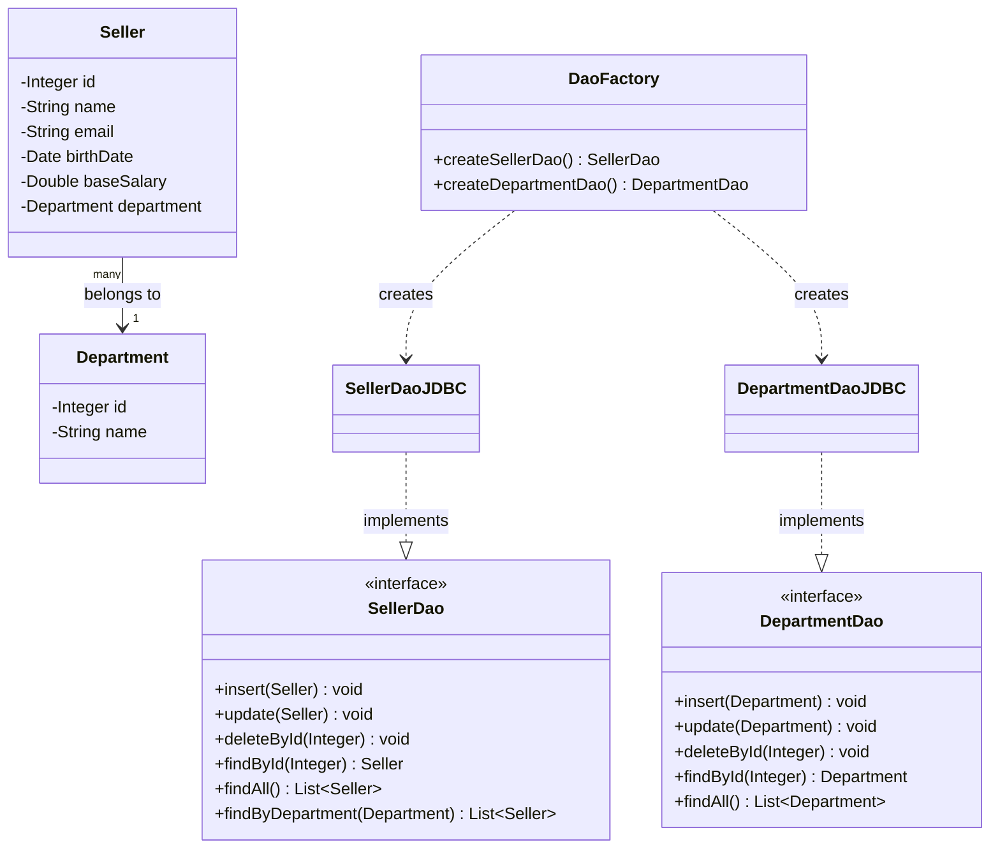

# DAO Pattern with JDBC (Java)

A study project implementing the **DAO (Data Access Object)** pattern with plain **JDBC** against a MySQL database, focused on decoupling business logic from persistence logic. It models a small `Seller` / `Department` domain with full CRUD operations.

If you're a recruiter or hiring manager: quick highlights are below so you can evaluate faster.

> **Note for recruiters:** `db.properties` is committed in this repository with a fictitious, local-only password used purely for studying the JDBC connection setup — it was never a real production credential. This is **not** a database security best practice: in a real project, credentials would never be committed to version control. They would be excluded via `.gitignore` and provided through environment variables, a secrets manager, or a local config file kept out of the repository.

## Quick highlights

- DAO pattern: persistence-agnostic interfaces (`SellerDao`, `DepartmentDao`) with JDBC-specific implementations (`SellerDaoJDBC`, `DepartmentDaoJDBC`), created through a `DaoFactory`
- Full CRUD (`insert`, `update`, `deleteById`, `findById`, `findAll`) plus a relationship query (`findByDepartment`)
- `PreparedStatement` used throughout to prevent SQL injection, with generated keys retrieved after `insert`
- Centralized connection handling (`DB` class: singleton connection, externalized config via `db.properties`, resource cleanup helpers)
- Custom unchecked exceptions (`DbException`, `DbIntegrityException`) to translate `SQLException` into cleaner application-level errors

## Repository structure

| Folder | Focus |
|---|---|
| [`src/db`](src/db) | Connection management (`DB`) and custom exceptions |
| [`src/model/entities`](src/model/entities) | Domain classes: `Seller`, `Department` |
| [`src/model/dao`](src/model/dao) | DAO interfaces and the `DaoFactory` |
| [`src/model/dao/impl`](src/model/dao/impl) | JDBC implementations of the DAO interfaces |
| [`src/application`](src/application) | Demo programs exercising the DAOs (`Program.java` for `Seller`, `Program2.java` for `Department`) |

## Class diagram



## How to evaluate quickly

1. Start with [`model/dao/SellerDao.java`](src/model/dao/SellerDao.java) and [`model/dao/impl/SellerDaoJDBC.java`](src/model/dao/impl/SellerDaoJDBC.java) to see interface vs. implementation.
2. Check [`db/DB.java`](src/db/DB.java) for connection lifecycle handling and externalized configuration.
3. Run [`application/Program.java`](src/application/Program.java) or [`application/Program2.java`](src/application/Program2.java) to see the DAOs exercised end to end (find, insert, update, delete).

## How to run

- Prerequisites: JDK 17+, a running MySQL instance, `mysql-connector-j` on the classpath
- Configure `db.properties` in the project root with your own credentials:
  ```properties
  user=your_user
  password=your_password
  dburl=jdbc:mysql://127.0.0.1:3306/your_database
  useSSL=false
  ```
  > ⚠️ **Security note:** never commit `db.properties` with real credentials. Add it to `.gitignore` and use placeholder values in version control.
- Compile and run:
  ```bash
  javac -d bin -cp "lib/*" $(find src -name "*.java")
  java -cp "bin:lib/*" application.Program    # or application.Program2
  ```
- Or open the folder in your IDE (IntelliJ IDEA, VS Code, Eclipse), add the MySQL connector as a dependency, and run `Program` or `Program2` directly.

## What I'm looking for

I'm looking for backend Java opportunities — internships, junior-level roles, or collaborative projects — where I can build reliable, well-tested server-side software.

## Contact

- GitHub: https://github.com/Menezesvm
- Email: menezesvgm@gmail.com
- LinkedIn: https://www.linkedin.com/in/viniciusmenezes2

---

See [`LEIAME.md`](LEIAME.md) for the Portuguese version of this document.
